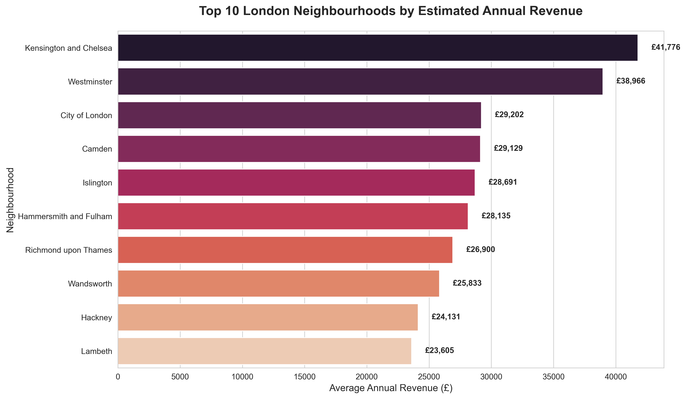

# 🏠 London Airbnb Strategic Analysis: Revenue & Market Trends

## 🎯 Project Overview
This project provides a data-driven roadmap for short-term rental investments in London. By processing **60,000+ records**, I engineered a revenue forecasting model to identify high-yield investment zones.

## 🛠️ Key Technical Features
- **Data Integration:** Merged 4 large-scale datasets (Listings, Calendar, Reviews, Neighbourhoods) from *Inside Airbnb*.
- **Advanced Cleaning:** Handled currency conversion, outlier removal using Quantile-based filtering (0.99), and missing value imputation.
- **KPI Engineering:** Developed custom metrics for `Occupancy Rate` and `Estimated Annual Revenue` for strategic benchmarking.

## 📈 Strategic Insights
- **Prime Zones:** **Westminster** and **Kensington & Chelsea** are the top revenue generators.
- **Pricing Strategy:** Identified a 'Sweet Spot' between **£150-£250** that maximizes both occupancy and profit margins.
- **Customer Satisfaction:** Found a strong correlation between high-end amenities and 4.7+ guest ratings.

## 🧰 Tech Stack
- **Language:** Python
- **Libraries:** Pandas, NumPy, Seaborn, Matplotlib
- **Tool:** Jupyter Notebook
